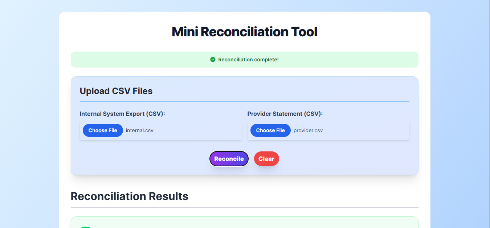

# Mini Reconciliation Tool

A simple web application that compares transactions between your internal system and your payment provider to detect discrepancies. This tool helps reconcile transactions by uploading two CSV files, comparing them, and highlighting matched, mismatched, and unique transactions.

---

## Features

- Upload two CSV files:
  - Internal System Export (your platform’s transaction records)
  - Provider Statement (payment processor’s transaction records)
- Compare transactions by `transaction_reference`.
- Categorize transactions into:
  - ✅ Matched Transactions
  - 💔 Mismatched Transactions (amount or status differ)
  - ⚠️ Present only in Internal file
  - ❌ Present only in Provider file
- Export each category as a CSV file.
- Responsive UI styled with Tailwind CSS.
- User feedback messages and loading spinner during processing.

---

## How to Use

1. Click **Choose File** to upload your Internal System Export CSV.
2. Click **Choose File** to upload your Provider Statement CSV.
3. Click **Reconcile** to compare the files.
4. View the reconciliation results divided into categories.
5. Use the **Export as CSV** buttons to download results for each category.
6. Use the **Clear** button to reset the form and results.

---

## Technologies Used

- **HTML5** and **JavaScript (ES6)**
- **[PapaParse](https://www.papaparse.com/)** — CSV parsing and exporting
- **Tailwind CSS** — Utility-first CSS framework for styling
- **Font Awesome** — Icons for UI enhancements

---

## Assumptions

- CSV files contain headers with at least the following columns: `transaction_reference`, `amount`, and `status`.
- Amounts are numeric and status values are consistent between files.
- Files are reasonably sized to process on the client side.
- Matching is done solely by `transaction_reference`.

---

## Scope and Limitations

- This tool performs client-side reconciliation; no backend or database is involved.
- CSV format must be consistent and valid for reliable results.
- No authentication or user management.
- Focused on transaction reconciliation only — no financial calculations or adjustments.
- Designed as a standalone tool suitable for small to medium CSV files.

---

## Live Demo

Try the live app here:  
[Mini Reconciliation Tool Live](https://f88c0546-d578-43da-91ae-f6655acbcd67-00-qntqad68euqw.kirk.replit.dev/)

---

## How to Run Locally

1. Clone or download this repository.
2. Open `index.html` in a modern browser.
3. Upload CSV files and start reconciling!

---

## Future Improvements

- Support for larger files with streaming parsing.
- Add date and time filtering options.
- Allow configurable matching keys and additional reconciliation rules.
- Implement backend support for persistent storage and user authentication.
- Enhance UI with charts and summary statistics.

---

## Author

Isaac Mwiti Kubai

## License

This project is open source and available under the MIT License.
